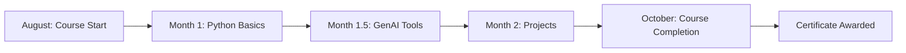

HEAD
# Projects-from-GanitAnk-Course
I begin my coding journey with python, learning syntax building projects and learning about GenAI.

# 🎓 Ganitank Python + GenAI Course Completion

<div align="center">
  
  
  
  
  
  

</div>

## 🎯 Overview
Completed my **Ganitank Python + GenAI course** - a well-designed course for students new to the world of coding. I've learned tons from this valuable experience!

<details>
<summary><b>Click to view course details</b></summary>

- **Course Type:** Beginner to Intermediate
- **Focus:** Python Programming + Generative AI
- **Format:** Hands-on Project Based
- **Outcome:** Certificate + Practical Skills
</details>

## 📚 What I Learned

### **Programming Fundamentals**
- ✓ What programming languages are and how they work
- ✓ Python syntax and core concepts
- ✓ Libraries and their practical usage
- ✓ Virtual environments setup and management
- ✓ Compilers and interpreters

### **GenAI & Development Tools**
- ✓ **Firebase Studio** - Backend development
- ✓ **Google Colab** - Cloud-based coding
- ✓ **Notebook LM** - AI-powered notebooks
- ✓ **Flask** - Web framework
- ✓ **Streamlit** - Interactive apps
- ✓ **LangChain** - API frameworks

## 🛠️ Projects

| Project | Type | Technologies Used | Description |
|---------|------|------------------|-------------|
| **Personal Budgeting Tool** | CLI Application | Python, File I/O | Command-line budgeting and expense tracking system |
| **AI Chatbot** | Web Application | Streamlit, Python | Interactive AI-powered chatbot with web interface |

### **Project Highlights**
```
✅ Personal Budgeting Tool (CLI Model)
    - Expense tracking and management
    - Budget planning features
    - Financial reporting
    - Memory via file handling (stores the data in a file to later retrieve it)

✅ AI Chatbot (Using Streamlit)
    - Interactive web interface
    - Natural conversation flow
    - Easy deployment

```

## 📅 Timeline



**Key Dates:**
- 🗓️ **Started:** August 2024 (during break)
- ⏱️ **Duration:** 2 months intensive learning
- 🎓 **Completed:** October 2024
- 📜 **Certificate:** Received upon project completion

## 🔧 Tools & Technologies

<div align="center">

| Category | Tools |
|----------|-------|
| **Programming** | `Python` `Git` `CLI` |
| **AI/ML** | `Google Colab` `Notebook LM` `LangChain` |
| **Web Dev** | `Flask` `Streamlit` `Firebase` |
| **Environments** | Virtual Environments, Cloud IDEs |

</div>

## 🏆 Certificate & Achievement

**🎫 Certificate Status:** ✅ **AWARDED**

**This marks my first small leap towards larger goals in technology and AI development.**

## 💭 Reflection

> "This course was perfectly structured for beginners with constant guidance and crisp explanations for each topic. The hands-on approach made complex concepts easy to understand and implement."

### **Key Takeaways:**
1. Solid foundation in Python programming
2. Practical experience with modern AI tools
3. Confidence to build real-world applications
4. Understanding of full project development cycle

## 🚀 Future Goals

This is **the beginning of a new era** in my learning journey. Next steps include:

- 🔍 Exploring advanced AI/ML concepts
- 🌐 Building more complex web applications
- 🤝 Contributing to open-source projects
- 📊 Diving into data science and analytics

---

<div align="center">

### **🌟 Journey Milestone Completed 🌟**

**"From coding novice to building AI applications - this course has been transformative!"**

📌 *This repository documents my learning journey and projects from the Ganitank Python + GenAI Course*

</div>

<br>

<p align="center">
  <i>Last Updated: February 2026</i>
</p>

